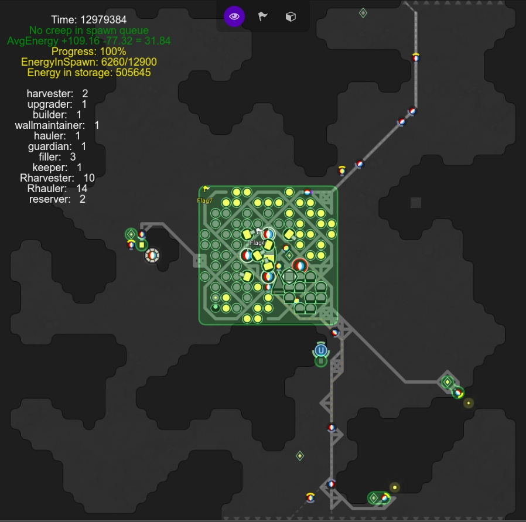

# LiveScreep

 最新版本 => `v0.5-Bunker`

* 基本的房间规划系统（做好自有房间中所有建筑的规划，并安排时间进行建设或是重建）
* 实现 原地丢弃，容器收纳，Link 传输以及外矿（包括按需生产的建设者与守护者） 这四种挖矿方式
* 基本的 Tower 逻辑，支持攻击、治疗和修复建筑
* 守护者会反击入侵者时会尽量待在 Rampart 中
* 房间无法抵御攻击时，自动激活 Safe Mode  并给玩家发送提醒
* 能量储备过多时，会生产更多更大的升级者，加快控制器升级速度
* 支持 Link 的管理，Source 和房间出口附近的 Link 会向房间中部的 Link 发送能量，随后特殊的 creep 会取出能量并配送到需要的地方
* 提前生产 creep，减小空窗期的影响
* 任务机制，每个任务会影响生产队列并调整 creep 的任务目标
* 通过 Terminal 平衡多个自有房间的能量储备
* 多余的能量会通过 Terminal 售出
* 所有自有房间会共享 Observer 提供的房间视野

# 声明

本仓库中的代码仅用于 Screeps 游戏中。

仅供参考学习，不建议直接使用本仓库中的代码进行游玩，毕竟 Screeps 是一个编程游戏，自己开发才有意思。

# 快速开始

> 注意：本项目仍在开发中，可能存在问题。
> 不过你可以看看代码，可读性还是有一定保证的。

* 查看 [文档](https://github.com/LuckyKoala/LiveScreep/wiki)
* Clone 本项目
* `npm install` 安装相关依赖 

## 向 Screeps  服务器提交代码

* [查看 GruntJS  并安装 grunt-cli](https://gruntjs.com/getting-started)
* 在根目录下编辑 `.screeps.json` ，写入邮件、分支、是否 指定 PTR、密码以及私有目录（如果你想提交到私有服务器）
* `grunt` 推送代码至 Screeps 官方服务器
* `grunt private` 推送代码至 Screeps 私有服务器
