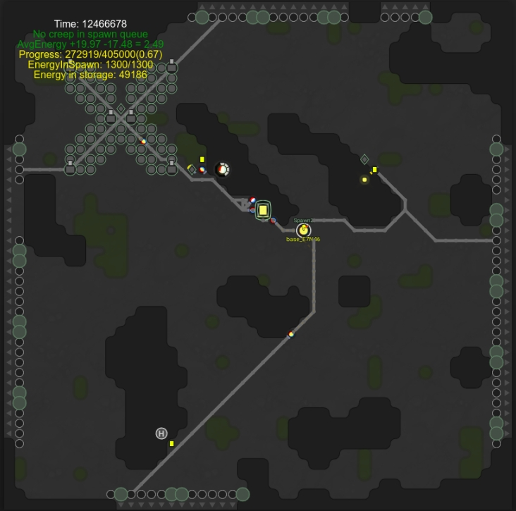

# LiveScreep

Latest Release => `v0.4-Road`

* Simple room plan system
* Burn extra energy of storage to controller(more upgrader, bigger upgrader)
* Implemented drop-mining, container-mining, link-mining and remote-mining.
* Running links and towers
* Guardian will try stay in rampart and fight invaders
* Automatically active safe mode and send notification to player if the room can't handle the attack
* Task system which manipulate spawn queue and adjust target of chosen creeps

# Declaration

This repo is the codebase of AI which is only used in Screeps.

Anyone who are interested in playing Screeps may learn something from this repo. But you better not to used this repo in official world directly since Screeps is a game of programming instead of a game of cheating.

# Getting Started

> NOTE: This codebase is still under development, so be careful to directly use it in official screeps world.
> And you can always read the code, readability is guaranteed :)

* Check [Documentation](https://github.com/LuckyKoala/LiveScreep/wiki)
* Clone this repo
* `npm install` to install dependencies

## Commit code to Screeps server

* [Check GruntJS and Install grunt-cli](https://gruntjs.com/getting-started)
* Write a `.screeps.json` which contains email, branch, ptr, password and `private_directory`(if you want commit it to local for private server) in root directory
* `grunt` to push code to Official Screeps Server
* `grunt private` to push code to Private Screeps Server
