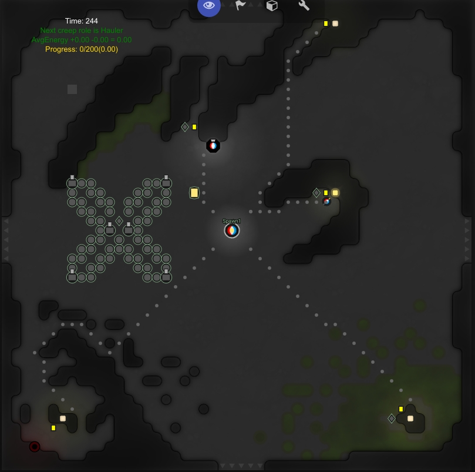

# LiveScreep

Latest Release => `v0.3-Tasks`

* Base harvesting, hauling, storage filling and withdrawing
* Implemented drop-mining, container-mining, link-mining and remote-mining.
* Keep upgrading controller
* Automatically place containers, extensions, roads, links, storage and towers
* Towers can select target and then attack, heal or repair
* Maintain walls and ramparts
* Guardian will try stay in rampart and fight invaders
* Automatically active safe mode and send notification to player if the room can't handle the attack
* Harvest minerals and store them in storage.
* Auto claim and build up outpost

NOTE: Currently room plan system is under development, structures planned by LiveScreep may overlapped, but it will not dismantle anything for now.

# Getting Started

> NOTE: This codebase is still under development, so be careful to directly use it in official screeps world.
> And you can always read the code, readability is guaranteed :)

* Check [Documentation](https://github.com/LuckyKoala/LiveScreep/wiki)
* Clone this repo
* `npm install` to install dependencies

## Commit code to Screeps server

* [Check GruntJS and Install grunt-cli](https://gruntjs.com/getting-started)
* Write a `.screeps.json` which contains email, branch, ptr, password and `private_directory`(if you want commit it to local for private server) in root directory
* `grunt` to push code to Official Screeps Server
* `grunt private` to push code to Private Screeps Server
