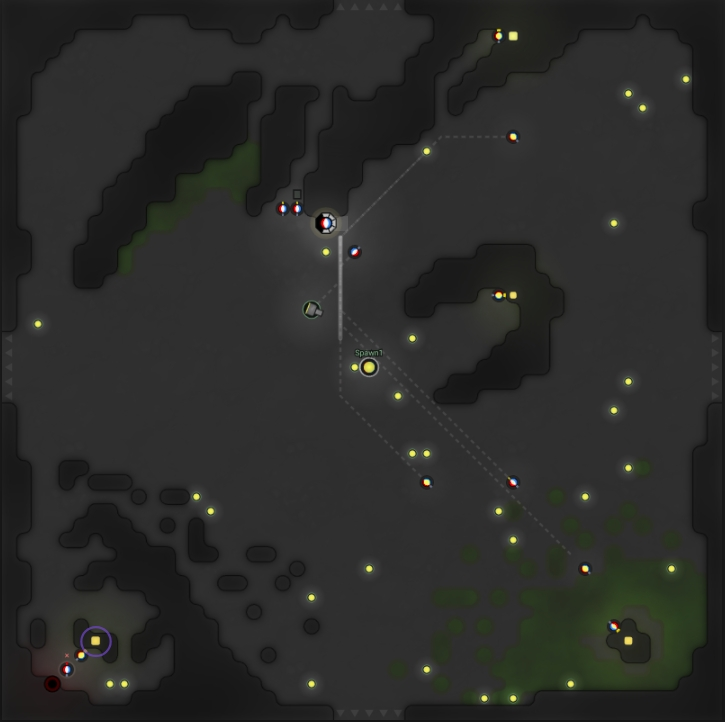

# LiveScreep

Latest Release => `v0.1-StupidHalfAutomated`

* Automatically place containers, extensions, roads and towers
* Keep upgrading controller
* Towers can select target and then attack, heal or repair
* Base harvesting, hauling, storage filling and withdrawing
* Maintain walls and ramparts
* When tower is present, a guardian will be spawned and help guard the room
* Automatically active safe mode and send notification to player if the room can't handle the attack
* Implemented logic of drop-mining, container-mining, link-mining and remote-mining. (Currently remote-mining are not automatically used, so if you want to use it, you have to dig in codebase and manually place some flags)
* Semi-implemented SK-mining

NOTE: Currently extensions are placed randomly.

# Getting Started

> NOTE: This codebase is still under development, so be careful to directly use it in official screeps world.
> And you can always read the code, readability is guaranteed :)

* Clone this repo
* `npm install` to install dependencies

## Commit code to Screeps server

* [Check GruntJS and Install grunt-cli](https://gruntjs.com/getting-started)
* Write a `.screeps.json` which contains email, branch, ptr, password and `private_directory`(if you want commit it to local for private server) in root directory
* `grunt` to push code to Screeps Server
* `grunt private` to push code to Screeps Server

# Introduction

Inspired by [Behaviour-Action Pattern for Screeps Game](https://github.com/Kaiaphas/screeps.behaviour-action-pattern)

All creeps have a role, different role have different strategy on choosing next action.

All roles have two action stack which imply what this role will do once fulfill the requirment of actions.(Currently inStack for acquire energy and outStack for consume energy)

All actions have own targets set, it will move to target and do according action(Build, Repair, Withdraw etc.)

All setups is pair with role, all the things about body parts and initial memory goes there.

And all extension of prototype of game objects is located in extension.js.

You can create config.override module to override some default options, this feature is still under experiment. 

Other utilize function set goes util and service modules.

For convenience, all role/setup/action/util module will be assigned to global scope which is done in global.js.

## Actions

### Base Actions

* Harvest: mark source and harvest energy from source, if creep can't reach source, make it move towards source.
* Fill: fill energy to spawns and extensions. 
* Build: build construction sites on the ground.
* Drop: just drop energy on the ground.
* Pickup: pickup energy on the ground, sorted by range.
* Withdraw: hauler withdraw energy from non-empty containers and storage, and filler do what?(Unknown until I re-read my code written before -.-ll)
* Put: harvester put energy to container assigned to source, and others put energy to container except those has been assigned to source.
* Upgrade: upgrade controller of course.

### Extended Actions

* Dismantle: dismantle flagged structures, the flag associated is described in global.FlagUtil.
* Fuel: fuel energy in towers.
* Guard: attack nearest hostile creep, sorted by ThreatValue.
* Invade: attack nearest hostile creep, sorted by ThreatValue.
* Maintain: maintain ramparts so it will not decay to nil.
* Repair: too complicated, simplify it later -.-;;
* Travel: travel to destination.
* Recycle: go to spawn and let spawn recycle self.

# TODO

## Room planner

* implement Dissi Flower layout, which contains 60 extensions, 4 towers and 1 link
* auto place links near sources
* auto place link near storage

## Honour roads

* optimize moveTo, like travelTo(bonzAI): add options to ignoreCreeps and repath if stuck
* reduce move part and optimize pathfinding once roads are completed

## Optimize spawning process of creep

* Skip executing role function if creep is still spawning
* add Role.Replacer which will move to target and inherit its memory and role, once replacer get those assets from target, the target will become Role.Recycler
* pre-spawn replacer of dying worker

## Task system and remote mining

* implement flag based task system
* auto place links near exit to receive resources from remote mining hauler
* implement room score system which tells how the room be suitable for mining, claiming and raiding
* implement remote mining, include harvester, hauler, road builder and guardian

## Base passive defense

* auto place walls and ramparts

## Active defense

* guardian respect ramparts
* tower only attack hostile creeps if necessary, aka it should try to avoid being drained by hostile creep

## More robust room planner

* check integrity of structures and rebuild if necessary

## Mineral processing

* auto place extractor
* hauler should be aware of concrete type of resources now(mineral or energy), and related harvest action should be updated accordingly
* auto place labs
* mineral processing system (may include terminal service)

## Raiding party

* tower-draining for zombie room
* room-siege for other room

## Others

* Assign a role depends on its body part if role of creep is undefined
* Optimize Action.Pickup, only for source drop by harvester(let hauler do it) and by recycler(let ant do it), so the pos is fixed, make use of it.
* Simplify logic in Action.Withdraw and Action.Put
* Make use of Creep.pull and Creep.accept, e.g remove MOVE part from Fixed Worker
